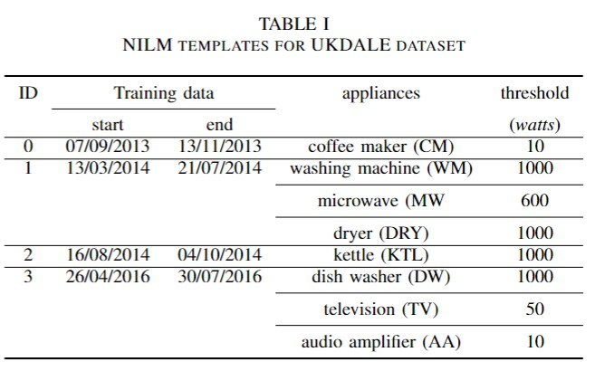
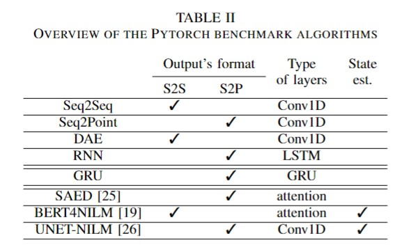
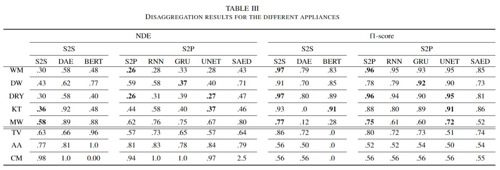
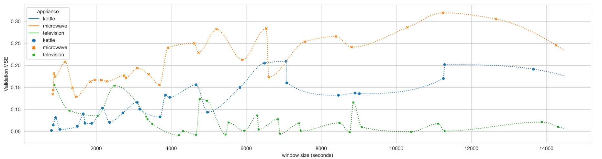

# DNN-NILM-benchmark

The current repoistory contains a set of benchmarks build on top of **Deep-NILMtk** established using the [uk-dale](provide link here please) **experiment-template** offered in the toolkit. The repository captures the whole training process and the execution environment with **MLFlow**. The goal is to provide a universal benchmark repository available for scholars in the **NILM scholarship** to use and extend with their own experiments for more transparency and easy reproducibility.
The benchmark gathers the results from two different experiments on three different appliances as follows:

The templates consider the following appliances from the first building of the ukdale dataset:



## 2. Benchmarking NILM Algorithms

The NILM bechmarked NILM algorithms ae illustrated in 



The obtained results are as follows:




## 2. Investigation of the window size

The aim of this first experiment is to explore the effect of the window size 
of the training process and the overall performance of model. Only one model 
is used for this phase and the related literature shows that the 
sequence-length is not related to the model used but rather to 
the characteristics of an appliance. The results obtained for this
phase are illustrated in the following figure:




## Instructions to preview the benchmark

Previewing the results requires the 
installation of [mlflow](https://github.com/mlflow/mlflow). 

```bash
cd mlflow
mlflow ui
```
## Author
**Hafsa Bousbiat**, email: [hafsa.bousbiat@gmail.com](hafsa.bousbiat@gmail.com)


## Copyright and license
Code released under the [MIT Licence](https://github.com/BHafsa/Deep-NILM-benchmark/blob/main/LICENSE).
